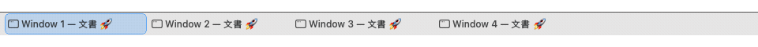

# TinyTaskbar

**A real taskbar for macOS. One button per window, on every display.**

TinyTaskbar keeps every window one click away in a compact native bar—without
thumbnails, visual clutter, or a browser runtime.

<p align="center">
  
</p>

## Features

- **Window-first** — each window gets its own stable taskbar button.
- **Direct control** — focus, restore, minimize, or close without hunting through
  menus.
- **Your workspace** — pin launchers, exclude apps, and choose labels or compact
  icons.
- **Live signals** — see application attention and Dock badges without layout churn.
- **Every display** — keep windows on their display, mirror them, or use one combined
  taskbar.
- **Dock replacement** — optionally keep the Mac Dock hidden while TinyTaskbar runs.

## Install

TinyTaskbar requires macOS 26. Releases are universal for Apple silicon and Intel.

### Homebrew

```sh
brew trust --tap mrkbac/tap
brew install --cask mrkbac/tap/tinytaskbar
```

### Direct download

Download the latest DMG from [Releases](https://github.com/mrkbac/tinytaskbar/releases/latest),
drag TinyTaskbar to Applications, and open it.

TinyTaskbar is distributed without an Apple Developer ID certificate. If macOS blocks
the first launch, follow the safe [Open Anyway instructions](docs/INSTALL_UNSIGNED.md).

## Permissions and privacy

TinyTaskbar runs entirely on your Mac with no network requests, analytics, telemetry,
or Screen Recording permission. Accessibility is used only to list and control
windows; no thumbnails or window content are captured. One isolated private
Accessibility function preserves exact minimized-window identity.

## Build

Requires Xcode 26.6 with Swift 6.3.3.

```sh
swift test --disable-sandbox
bash scripts/build-app.sh --adhoc
```

## License

[GPL-3.0-only](LICENSE)
