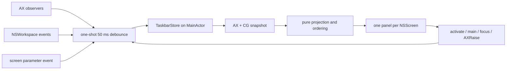

# TinyTaskbar technical design

## Scope and source of truth

TinyTaskbar is one AppKit executable target with one main-actor state owner:
`TaskbarStore`. The store owns the latest `TaskbarState`, permission availability,
lifecycle state, refresh debounce, and lightweight refresh metrics. Pure value seams
in `WindowModel.swift` keep policy deterministic and testable:

| Seam | Responsibility |
| --- | --- |
| `WindowEligibility` | running regular app, AX role/subrole, hidden/minimized, usable-size policy |
| `CGWindowMatcher` | conservative PID/layer/on-screen/bounds/title match |
| `WindowCGAssignment` | deterministic one-to-one consumption of CG records per snapshot |
| `WindowObservationKey` | shared projected/activation and unique observer key derivation |
| `DisplayMapper` | greatest intersection, deterministic tie, center/nearest fallback |
| `TaskbarPanelLayout` | full/visible AppKit frame placement with Dock-aware bottom inset |
| `TaskbarButtonLayout` | compact title-on/title-off width bounds |
| `WindowOrdering` | numbered windows first in numeric order, then stable fallback keys |
| `WindowDeduplicator` | one item per stable observation key |
| `LifecycleReducer` | launch, permission change, and stop transitions |
| `WindowProjection` | converts raw observations into the store’s display state |

The runtime flow is event-driven:



There is no repeating enumeration timer, polling loop, helper, database, or
background daemon. Healthy steady state is quiet; a refresh occurs after relevant
window, application, Space, display, or activation events.

The executable uses an explicit `@main` `TinyTaskbarMain` entry point. Its main-actor
`main()` creates `NSApplication.shared`, assigns an `AppDelegate`, and wraps
`application.run()` in `withExtendedLifetime(delegate)`. That explicit owner is
required because the local macOS 26 SDK declares `NSApplication.delegate` weak, and
it keeps the delegate alive for the complete AppKit run. This avoids depending on
Swift's `@main` AppDelegate synthesis or framework-driven principal-class startup in
the manually assembled SwiftPM bundle. The local macOS 26 SDK exposes the
`NSApplication.shared`, `delegate`, and `run()` APIs used here, so the bundle does not
need an `NSPrincipalClass = NSApplication` Info.plist entry; `LSUIElement` remains the
explicit bundle-level accessory setting.

`AppDelegate` receives small main-actor `AccessibilityPermissionProvider` and
`WindowSnapshotProvider` seams. Production implementations call the public AX and
Core Graphics/AppKit APIs. Tests inject mock providers to prove denied startup does
not enumerate, granted/revoked transitions refresh and clear state, and stale
activation is harmless. Debug builds additionally accept the explicit
`--ui-test-fixture=normal|overflow|empty` argument; the fixture provider supplies
deterministic metadata to the real panels without calling AX or TCC.

## Accessibility onboarding and minimal settings

`AppDelegate` lazily creates and then retains one native `TinyTaskbarSettingsWindow`;
trusted taskbar-only launches do not construct the Settings hierarchy. It is a normal,
key-capable `NSWindow` only while explicitly shown. On first launch when onboarding
is incomplete, or whenever Accessibility is denied, the app refreshes permission and
launch-at-login status, calls the current public `NSApp.activate()` API, explicitly
orders the retained window front regardless, and makes it key when supported.
Standard window close and Done only close the guide; the app
continues running, and `applicationShouldTerminateAfterLastWindowClosed` is false.
`applicationShouldHandleReopen` shows and activates the same window when an already
running app is launched again.

The retained Settings window is a non-resizable fixed-size AppKit window with an
explicitly framed 640 × 340 point content view. Its content min/max sizes are both set
to that value after interface setup. The root vertical stack is constrained to fixed
content-view insets, and every arranged row is constrained to the stack width. The
window's fixed content min/max size prevents intrinsic fitting from resizing it while
Auto Layout keeps the hierarchy's geometry finite during presentation and AX reads.
Each arranged row uses the same content width and leading alignment, so
Granted/Required accessory-width
changes cannot shift row labels. The introduction uses the full available content
width, action accessories retain their intrinsic button/control
widths, and the launch-at-login status is constrained to 190 points and at most two
wrapped lines. After the first WindowServer order, one main-actor yield reasserts and
centers the fixed frame once; this avoids a transient intrinsic-fitting resize without
polling.

The initial launch show is deferred by one `Task.yield()` on the main actor because
`applicationDidFinishLaunching` runs before the first application event-loop turn;
reopen handling remains synchronous. The UI logger records launch permission/onboarding
state, activation-policy failures, and debug-only final presentation state.

Because an `LSUIElement` accessory app can still be suppressed by WindowServer when
bringing a normal window forward, the explicit Settings-show path temporarily sets
the activation policy to `.regular` before activation and ordering. macOS may show a
TinyTaskbar Dock icon while Settings is visible; the close callback for either X or
Done restores `.accessory`, deactivates the app, and removes that temporary Dock
presence. Taskbar panels never use `.regular` and remain non-activating.

The guide explains the utility and Accessibility requirement, shows Granted/Required
status, and exposes clearly labelled controls. Only the explicit Enable Accessibility…
or Open Accessibility Settings… action calls `AXIsProcessTrustedWithOptions` with
`prompt: true` and opens the public
`x-apple.systempreferences:com.apple.preference.security?Privacy_Accessibility`
destination. Returning to TinyTaskbar is handled by `applicationDidBecomeActive`,
which rechecks `AXIsProcessTrusted()` and updates `TaskbarStore` and the row without
polling. The request decision is a small one-shot value seam; TCC is never changed by
the app.

The same window contains only the required minimal settings. Launch at Login uses
public `SMAppService.mainApp` status/register/unregister calls and displays unavailable,
approval-required, or error states inline; there is no helper or login-item target.
Show Window Titles defaults to true and persists in `UserDefaults`. When disabled,
compact buttons use the owning application name while retaining app icons, full
accessibility labels, and tooltips. The current `TaskbarState` is rerendered
immediately without re-enumerating windows. A Quit TinyTaskbar button is provided.
Taskbar panels remain non-activating and never use the settings-window activation path.

## Window eligibility and Space semantics

For each running regular GUI application other than TinyTaskbar, AX enumeration
requires role `AXWindow` and subrole `AXStandardWindow` or `AXDialog`. Sheets,
popovers, menus, toolbars, floating/utility/system/panel/transient surfaces are not
accepted by that subrole rule. Hidden and minimized applications/windows are
excluded, as are malformed frames and surfaces smaller than 80 × 40 points. That
size is a conservative v1 guard against tiny/transient surfaces, not a claim that
all applications use the same minimum window size.

AX positions and Core Graphics bounds already use the same global top-left screen
coordinate space, so no AX→CG flip or main-display-height conversion occurs. The
AppKit bottom-left coordinate system is used only for panel frames sourced separately
from `NSScreen`. The unchanged AX frame must match a layer-zero, on-screen Core
Graphics window for the same PID. Bounds are compared within four points, with title
matching preferred when both titles are available. A unique bounds match remains
valid when AX and CG title updates race; multiple equal-bounds candidates still
require title disambiguation. This is deliberately conservative:
public APIs expose no supported AX-to-CG window-ID bridge. A matched CG window number
is used as the stable key when available; otherwise PID, normalized title, and rounded
geometry form the fallback key.

Within each snapshot, `WindowCGAssignment` sorts candidates and consumes each
matching CG record at most once. The same assignment is used while associating AX
elements for activation and while projecting taskbar items, so two identical
overlapping AX observations can produce two items only when two distinct CG window
numbers exist. `WindowObservationKey` derives the shared item/activation key and
unique observer keys from those assignments; an unassigned duplicate is retained
only as an observer record with an ordinal and cannot become a clickable item.

An untitled eligible window displays its localized application name. Windows are
assigned to the display with the greatest positive intersection area. Equal areas
are resolved by stable display identifier; only if there is no positive intersection
does the projection use a containing center and then nearest-screen distance.

`CGWindowListCopyWindowInfo(.optionOnScreenOnly, .excludeDesktopElements, ...)`
represents the active Space conservatively. This includes a current fullscreen
window when CG reports it on-screen and excludes other-Space/off-screen windows.
Stage Manager background sets are omitted for the same reason. Exact arbitrary
Space IDs, minimized membership, and cross-Space movement are intentionally not
attempted because the supported public API surface does not provide them.

## Observation and failure isolation

`AXObserverRegistry` creates one public `AXObserver` per eligible application and
adds app-level notifications for window creation/destruction, focus/main changes,
and hidden/shown state. It adds per-window notifications for moved, resized,
miniaturized/deminiaturized, title, and destroyed events when an app supports them.
Unsupported notifications are logged at debug level and do not prevent other apps
from being observed. Invalid AX elements, malformed values, inaccessible apps, and
CG conversion failures are isolated to that application/window.

`SystemEventObserver` listens for `NSWorkspace` launch, terminate, activate, hide,
unhide, and active-Space notifications plus
`NSApplication.didChangeScreenParametersNotification`. Every event goes through the
same short one-shot debounce; there is no continuous polling.

The process-wide public AX messaging timeout is 250 ms, bounding each synchronous
request so one unresponsive application cannot indefinitely block the main actor.
Per-window role, geometry, title, and state are read in one public
`AXUIElementCopyMultipleAttributeValues` batch. Window-list failures, aggregated
batch/malformed counts, observer registration failures, and partial activation
error codes are logged at debug level without emitting a success-path line per
window.

## Activation and panels

Activation defensively tries to clear `AXMinimized`, activates the owning
`NSRunningApplication`, sets `AXMain` and `AXFocused` when supported, and performs
`AXRaise`. All operations tolerate stale references. The resulting notification
path schedules a refresh.

Window order is stable across focus changes: items use their numeric Core Graphics
window identity as creation-style order, with stable application/item keys as the
fallback. Active state changes only presentation, so clicking never moves the target
out from under the pointer. Each item has one
native context command, Close, paired with AppKit's standard `xmark` symbol so the
menu's symbol column is intentional rather than empty. The command reads the window's public
`kAXCloseButtonAttribute` and performs `kAXPressAction`, matching the semantic red
window control and preserving any save-confirmation UI owned by the target app.
Missing, stale, or unsupported close controls are isolated to that item.

Each `TaskbarPanel` is a borderless, non-activating `NSPanel` with
`canBecomeKeyWindow == false` and `canBecomeMainWindow == false`. It uses the
documented `.statusBar` level and this non-conflicting public collection set:

```swift
[.canJoinAllSpaces, .canJoinAllApplications, .fullScreenAuxiliary, .ignoresCycle]
```

Apple documents `primary`, `auxiliary`, and `canJoinAllApplications` as mutually
exclusive within the Stage Manager/fullscreen group; TinyTaskbar selects only
`canJoinAllApplications`. The horizontal AppKit stack is inside an `NSScrollView`,
uses copied/cached application icons, falls back to the native `macwindow` symbol for
a stale or unavailable application icon, truncates titles, marks active items with a
subtle neutral emphasis, and provides button accessibility labels. The 30-point bar
uses AppKit's native header/footer material, spans the usable display width, and has
no floating outer inset. It is deliberately an overlay because third-party panels
cannot reserve Dock-like work area.

Panel frames are calculated from the AppKit full and visible frames, not from AX
geometry. The panel is flush with the usable horizontal and bottom edges: a bottom
Dock lifts it exactly to the visible-frame boundary while a side Dock trims its
horizontal span without lifting it. Tiny and
negative-origin displays are clamped deterministically. The title-off width range
starts below the title-on minimum so app-name-only buttons stay compact while
retaining their icon, tooltip, and full accessibility label.

## Public API and privacy boundary

The implementation uses only AppKit, ApplicationServices Accessibility, Core
Graphics window metadata, Foundation, and OSLog. It does not use private SkyLight,
CGS, `_AXUIElementGetWindow`, Screen Recording, ScreenCaptureKit, or window
thumbnails. App Sandbox is disabled in the minimal entitlements file: systemwide
AX inspection/control is the core operation, and v1 is intended for Developer ID
distribution outside the Mac App Store. Hardened Runtime is enabled by the
Developer ID build script with no runtime exceptions.

## Reference research and techniques

The following projects were inspected for techniques, not copied architecture:

* [Switch](https://github.com/Sanyam-G/switch) demonstrates a focused native
  window-switching interaction, MRU ordering, and a compact AppKit-oriented
  distribution flow.
* [Tinycast](https://github.com/abue-ammar/tinycast) demonstrates a small native
  footprint, no telemetry/background CPU churn, and explicit build/release docs.
* [AltTab](https://github.com/lwouis/alt-tab-macos) demonstrates combining AX titles
  and focus notifications with public Core Graphics window metadata, while also
  showing why thumbnails and cross-Space feature scope are separate concerns.
* [Rectangle](https://github.com/rxhanson/Rectangle) demonstrates a mature native
  Accessibility-based window-control utility and the importance of permission and
  failure handling.

The implementation boundary was checked against the installed Xcode 26.6 SDK
headers: `AXUIElement.h`, `AXNotificationConstants.h`, `AXAttributeConstants.h`,
`CGWindow.h`, `NSPanel.h`, `NSWindow.h`, `NSWorkspace.h`, and `NSApplication.h`.
The Core Graphics header marks `kCGWindowWorkspace` as deprecated, so it is not
used.

The corresponding current Apple references are [AXUIElement.h](https://developer.apple.com/documentation/applicationservices/axuielement_h),
[`CGWindowListCopyWindowInfo`](https://developer.apple.com/documentation/coregraphics/cgwindowlistcopywindowinfo%28_%3A_%3A%29),
[`NSWindow.CollectionBehavior`](https://developer.apple.com/documentation/appkit/nswindow/collectionbehavior-swift.struct),
[`NSPanel`](https://developer.apple.com/documentation/appkit/nspanel),
[`NSWorkspace`](https://developer.apple.com/documentation/appkit/nsworkspace), and
[Notarizing macOS software before distribution](https://developer.apple.com/documentation/security/notarizing-macos-software-before-distribution).
