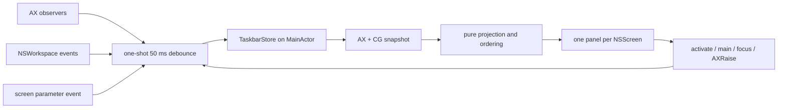

# TinyTaskbar technical design

## Scope and source of truth

TinyTaskbar is one AppKit executable target with one main-actor state owner:
`TaskbarStore`. The store owns the latest `TaskbarState`, permission availability,
lifecycle state, refresh debounce, and lightweight refresh metrics. Pure value seams
in `WindowModel.swift` keep policy deterministic and testable:

| Seam | Responsibility |
| --- | --- |
| `WindowEligibility` | running regular app, AX role/subrole, hidden/minimized, usable-size policy |
| `CGWindowMatcher` | conservative PID/layer/on-screen/bounds/title match |
| `DisplayMapper` | greatest intersection, deterministic tie, center/nearest fallback |
| `WindowOrdering` | active first, app name, title, stable key |
| `WindowDeduplicator` | one item per stable observation key |
| `LifecycleReducer` | launch, permission change, and stop transitions |
| `WindowProjection` | converts raw observations into the store’s display state |

The runtime flow is event-driven:



There is no repeating enumeration timer, polling loop, helper, database, or
background daemon. Healthy steady state is quiet; a refresh occurs after relevant
window, application, Space, display, or activation events.

## Window eligibility and Space semantics

For each running regular GUI application other than TinyTaskbar, AX enumeration
requires role `AXWindow` and subrole `AXStandardWindow` or `AXDialog`. Sheets,
popovers, menus, toolbars, floating/utility/system/panel/transient surfaces are not
accepted by that subrole rule. Hidden and minimized applications/windows are
excluded, as are malformed frames and surfaces smaller than 80 × 40 points. That
size is a conservative v1 guard against tiny/transient surfaces, not a claim that
all applications use the same minimum window size.

AX positions and Core Graphics bounds already use the same global top-left screen
coordinate space, so no AX→CG flip or main-display-height conversion occurs. The
AppKit bottom-left coordinate system is used only for panel frames sourced separately
from `NSScreen`. The unchanged AX frame must match a layer-zero, on-screen Core
Graphics window for the same PID. Bounds are compared within four points, with title
matching preferred when both titles are available. This is deliberately conservative:
public APIs expose no supported AX-to-CG window-ID bridge. A matched CG window number
is used as the stable key when available; otherwise PID, normalized title, and rounded
geometry form the fallback key.

An untitled eligible window displays its localized application name. Windows are
assigned to the display with the greatest positive intersection area. Equal areas
are resolved by stable display identifier; only if there is no positive intersection
does the projection use a containing center and then nearest-screen distance.

`CGWindowListCopyWindowInfo(.optionOnScreenOnly, .excludeDesktopElements, ...)`
represents the active Space conservatively. This includes a current fullscreen
window when CG reports it on-screen and excludes other-Space/off-screen windows.
Stage Manager background sets are omitted for the same reason. Exact arbitrary
Space IDs, minimized membership, and cross-Space movement are intentionally not
attempted because the supported public API surface does not provide them.

## Observation and failure isolation

`AXObserverRegistry` creates one public `AXObserver` per eligible application and
adds app-level notifications for window creation/destruction, focus/main changes,
and hidden/shown state. It adds per-window notifications for moved, resized,
miniaturized/deminiaturized, title, and destroyed events when an app supports them.
Unsupported notifications are logged at debug level and do not prevent other apps
from being observed. Invalid AX elements, malformed values, inaccessible apps, and
CG conversion failures are isolated to that application/window.

`SystemEventObserver` listens for `NSWorkspace` launch, terminate, activate, hide,
unhide, and active-Space notifications plus
`NSApplication.didChangeScreenParametersNotification`. Every event goes through the
same short one-shot debounce; there is no continuous polling.

## Activation and panels

Activation defensively tries to clear `AXMinimized`, activates the owning
`NSRunningApplication`, sets `AXMain` and `AXFocused` when supported, and performs
`AXRaise`. All operations tolerate stale references. The resulting notification
path schedules a refresh.

Each `TaskbarPanel` is a borderless, non-activating `NSPanel` with
`canBecomeKeyWindow == false` and `canBecomeMainWindow == false`. It uses the
documented `.statusBar` level and this non-conflicting public collection set:

```swift
[.canJoinAllSpaces, .canJoinAllApplications, .fullScreenAuxiliary, .ignoresCycle]
```

Apple documents `primary`, `auxiliary`, and `canJoinAllApplications` as mutually
exclusive within the Stage Manager/fullscreen group; TinyTaskbar selects only
`canJoinAllApplications`. The horizontal AppKit stack is inside an `NSScrollView`,
uses cached application icons, truncates titles, marks active items visually, and
provides button accessibility labels. The bar is deliberately an overlay because
third-party panels cannot reserve Dock-like work area.

## Public API and privacy boundary

The implementation uses only AppKit, ApplicationServices Accessibility, Core
Graphics window metadata, Foundation, and OSLog. It does not use private SkyLight,
CGS, `_AXUIElementGetWindow`, Screen Recording, ScreenCaptureKit, or window
thumbnails. App Sandbox is disabled in the minimal entitlements file: systemwide
AX inspection/control is the core operation, and v1 is intended for Developer ID
distribution outside the Mac App Store. Hardened Runtime is enabled by the
Developer ID build script with no runtime exceptions.

## Reference research and techniques

The following projects were inspected for techniques, not copied architecture:

* [Switch](https://github.com/Sanyam-G/switch) demonstrates a focused native
  window-switching interaction, MRU ordering, and a compact AppKit-oriented
  distribution flow.
* [Tinycast](https://github.com/abue-ammar/tinycast) demonstrates a small native
  footprint, no telemetry/background CPU churn, and explicit build/release docs.
* [AltTab](https://github.com/lwouis/alt-tab-macos) demonstrates combining AX titles
  and focus notifications with public Core Graphics window metadata, while also
  showing why thumbnails and cross-Space feature scope are separate concerns.
* [Rectangle](https://github.com/rxhanson/Rectangle) demonstrates a mature native
  Accessibility-based window-control utility and the importance of permission and
  failure handling.

The implementation boundary was checked against the installed Xcode 26.6 SDK
headers: `AXUIElement.h`, `AXNotificationConstants.h`, `AXAttributeConstants.h`,
`CGWindow.h`, `NSPanel.h`, `NSWindow.h`, `NSWorkspace.h`, and `NSApplication.h`.
The Core Graphics header marks `kCGWindowWorkspace` as deprecated, so it is not
used.

The corresponding current Apple references are [AXUIElement.h](https://developer.apple.com/documentation/applicationservices/axuielement_h),
[`CGWindowListCopyWindowInfo`](https://developer.apple.com/documentation/coregraphics/cgwindowlistcopywindowinfo%28_%3A_%3A%29),
[`NSWindow.CollectionBehavior`](https://developer.apple.com/documentation/appkit/nswindow/collectionbehavior-swift.struct),
[`NSPanel`](https://developer.apple.com/documentation/appkit/nspanel),
[`NSWorkspace`](https://developer.apple.com/documentation/appkit/nsworkspace), and
[Notarizing macOS software before distribution](https://developer.apple.com/documentation/security/notarizing-macos-software-before-distribution).
